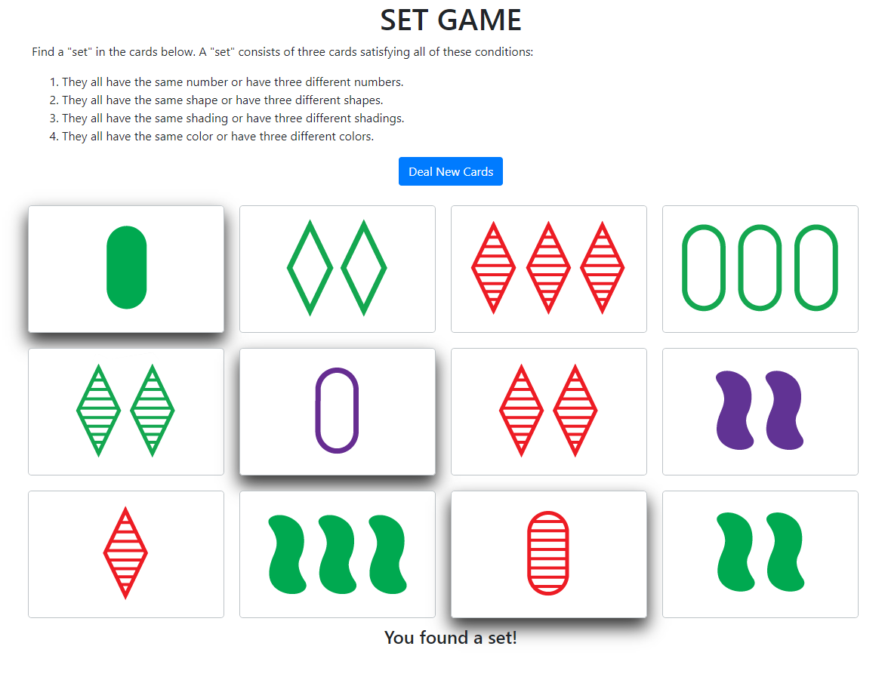

# SET Game
This repository is a Django app of the pattern recognition card game [SET](https://en.wikipedia.org/wiki/Set_(card_game)). For a demo of this app, visit https://jointdev.com/setgame.



## Requirements
* Python 3
* Django 3

### Setup
* Create a new Django project if you don't already have one.
* In your project directory, create a new directory called `setgame`.
* Clone this repo to the newly created directory.
* In your project's `url.py` add `path('', include('setgame.urls'))` to `urlpatterns`.
* In your `settings.py` file add `setgame` to `INSTALLED_APPS`.
* Create a new python file in the project directory with the following code and execute it.
```python
import os
os.environ.setdefault('DJANGO_SETTINGS_MODULE','PROJECT-NAME.settings')
import django
django.setup()
from setgame.models import Card
def add_cards_to_db():
    colors = ['red', 'green', 'purple']
    numbers = ['one', 'two', 'three']
    shadings = ['solid', 'striped', 'open']
    shapes = ['diamond', 'squiggle', 'oval']
    for color in colors:
        for number in numbers:
            for shading in shadings:
                for shape in shapes:
                    card = Card.objects.get_or_create(color=color, number=number,
                                                      shading=shading, shape=shape)[0]
if __name__ == '__main__':
    add_cards_to_db()
```
* Run the command `py manage.py makemigrations` followed by `py manage.py migrate`.
* Finally, test that everything is working fine `py manage.py runserver`.
